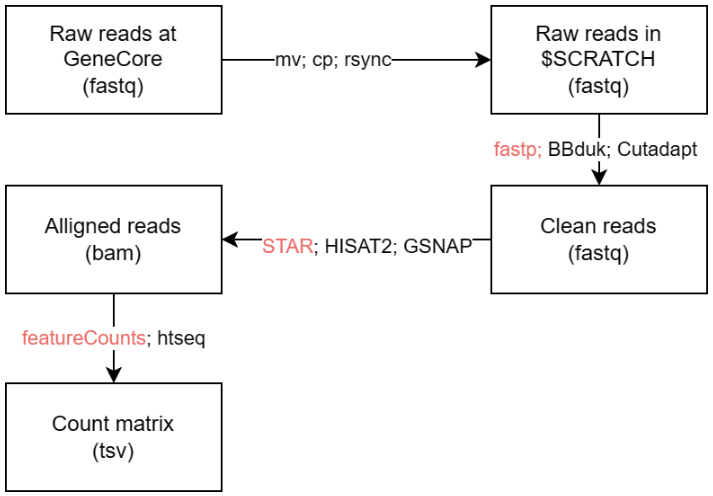

# Tutorial on RNA-Seq analysis

Author: Ji Huang


## 1. Environment preparation

### Terminal

You will need a terminal to interact with the server. Many cases, you will also need a FTP client to upload/download files to the server.

On windows, I like: Windows Terminal, Putty, MobaXterm, WinSCP, and FileZilla.

### Text editor

You will need a text editor to create/modify files on the server.

I like: Vim, VScode and Sublime Text.

### R

Once you generate the expression count matrix, you will mostly work in R for the RNA-Seq analysis.

RStudio, RStudio server, Jupyter Notebook.

## 2. Pipeline

The Basic pipeline that works with most of the RNA-seq data without UMI.




## 3. Slurm

Some slurm command that I use:

```shell
1. srun --mem 4GB --cpus-per-task 1 -t02:00:00 --pty /bin/bash
2. sacct -j <jobid> --format=JobID,JobName,state,exitcode,derivedexitcode,MaxRSS,Elapsed,MaxVMSize,MaxVMSizeNode,ReqMem
3. scontrol show jobid -dd <jobid> # for job details
4. seff <jobid> # efficiency of resource usage by the completed job
```
[Convenient SLURM Commands](https://docs.rc.fas.harvard.edu/kb/convenient-slurm-commands/)

A simple slurm job header:

```shell
#!/bin/bash
#SBATCH --nodes=1
#SBATCH --ntasks-per-node=1
#SBATCH --cpus-per-task=1  # modify this
#SBATCH --time=1:00:00     # modify this
#SBATCH --mem=2GB          # modify this
#SBATCH --job-name=test    # modify this
#SBATCH --mail-type=NONE
#SBATCH --mail-user=whoever@nyu.edu
#SBATCH --output=slurm_%j.out

module purge
```

## 4. Reads cleaning, aligning and counting

All for **single-end  reads**

```shell
# cleaning
fastp -l 20 --thread 1 -y -t 1 -x -a AGATCGGAAGAGC -f 2 -i input.fq.gz -o output2.fq.gz;

# aligning
STAR --genomeDir $STARREF --readFilesCommand zcat \
    --runThreadN 8 --readFilesIn output2.fq.gz \
    --outFilterType BySJout --outFilterMultimapNmax 20 \
    --outSAMattributes NH HI NM MD \
    --outSAMtype BAM SortedByCoordinate

# counting
featureCounts -s 1 -T 2 -a $GTF -o final.feacureCounts output2.bam
```


## 4. From count matrix to results

Once you have the count matrix, you can use R to analyze it. DESeq2, limma, edgeR are the most popular packages for Differential Expression analysis.


