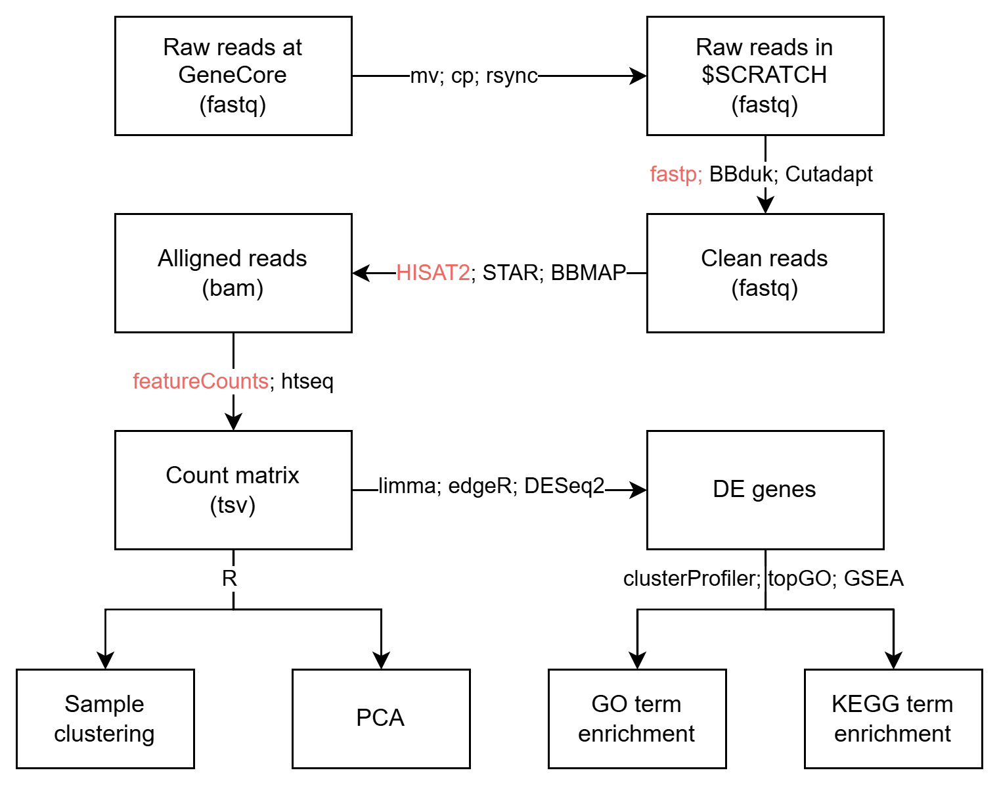

# Tutorial on RNA-Seq analysis

Author: Ji Huang

Last update: 2023-11-01

## 1. Environment preparation

### Terminal

You will need a terminal to interact with the server. Many cases, you will also need a FTP client to upload/download files to the server.

On windows, I like: Windows Terminal, Putty, MobaXterm, WinSCP, and FileZilla.

[tmux](https://github.com/tmux/tmux) is very good helper.

### Text editor

You will need a text editor to create/modify files on the server.

I like: Vim, VScode and Sublime Text.

Helper: `find .vscode-server/ -type f | wc -l`

### R

Once you generate the expression count matrix, you will mostly work in R for the RNA-Seq analysis.

RStudio, RStudio server, Jupyter Notebook.

## 2. Pipeline

The Basic pipeline that works with most of the RNA-seq data without UMI.




## 3. Slurm


[Source](https://sabryr.github.io/)

Some slurm command that I use:

```shell
1. srun --mem 4GB --cpus-per-task 1 -t02:00:00 --pty /bin/bash
2. sacct -j <jobid> --format=JobID,JobName,state,exitcode,derivedexitcode,MaxRSS,Elapsed,MaxVMSize,MaxVMSizeNode,ReqMem
3. scontrol show jobid -dd <jobid> # for job details
4. seff <jobid> # efficiency of resource usage by the completed job
```
[Convenient SLURM Commands](https://docs.rc.fas.harvard.edu/kb/convenient-slurm-commands/)

A simple slurm job header:

```shell
#!/bin/bash
#SBATCH --nodes=1
#SBATCH --ntasks-per-node=1
#SBATCH --cpus-per-task=1  # modify this
#SBATCH --time=1:00:00     # modify this
#SBATCH --mem=2GB          # modify this
#SBATCH --job-name=test    # modify this
#SBATCH --mail-type=NONE
#SBATCH --mail-user=whoever@nyu.edu
#SBATCH --output=slurm_%j.out

module purge

```

## 4. Reads cleaning, aligning and counting

All for **single-end reads**

```shell
# cleaning
fastp -l 20 --thread 1 -y -t 1 -x -a AGATCGGAAGAGC -f 2 \
    -i input.fq.gz -o output2.fq.gz;

# aligning
hisat2 -p 2 -x ${REF} -U output2.fq.gz 2>aln.info | \
    samtools view -bSh - | samtools sort -o output2.bam -

# counting
featureCounts -s 1 -T 2 -a $GTF -o final.feacureCounts output2.bam
```

## 5. Files

1. `fastq` format. [Wiki](https://en.wikipedia.org/wiki/FASTQ_format)

```
A FASTQ file has four line-separated fields per sequence:
Field 1 begins with a '@' character and is followed by a sequence identifier and an optional description (like a FASTA title line).
Field 2 is the raw sequence letters.
Field 3 begins with a '+' character and is optionally followed by the same sequence identifier (and any description) again.
Field 4 encodes the quality values for the sequence in Field 2, and must contain the same number of symbols as letters in the sequence.
```

```
>@SRR8699958.1 1/1
CGGGACTATACATTTACAACAAAAAGAAACAAATCTTGTGGTCAAAGTTTCCATACGTAGCTTCTCTTCTCTACAC
+
AAA/A/EAE6AAAE/EEEA/EEEEE6AEEEEAE6/E/////EEEEE6E/E/EA/EA//E/6/6EEEEE/E<EAE/6
```

2. `gtf` format. [GFF/GTF File Format - Definition and supported options](https://useast.ensembl.org/info/website/upload/gff.html)

```
#!genome-build TAIR10
#!genome-version TAIR10
#!genome-date 2008-04
#!genome-build-accession GCA_000001735.1
#!genebuild-last-updated 2010-09
1       araport11       gene    10942648        10944727        .       -       .       gene_id "AT1G30814"; gene_name "AT1G30814"; gene_source "araport11"; gene_biotype "protein_coding";
1       araport11       transcript      10942648        10944727        .       -       .       gene_id "AT1G30814"; transcript_id "AT1G30814.1"; gene_name "AT1G30814"; gene_source "araport11"; gene_biotype "protein_coding"; transcript_name "AT1G30814-203"; transcript_source "araport11"; transcript_biotype "protein_coding"; tag "Ensembl_canonical";
1       araport11       exon    10944317        10944727        .       -       .       gene_id "AT1G30814"; transcript_id "AT1G30814.1"; exon_number "1"; gene_name "AT1G30814"; gene_source "araport11"; gene_biotype "protein_coding"; transcript_name "AT1G30814-203"; transcript_source "araport11"; transcript_biotype "protein_coding"; exon_id "AT1G30814.1.exon1"; tag "Ensembl_canonical";
1       araport11       exon    10944078        10944229        .       -       .       gene_id "AT1G30814"; transcript_id "AT1G30814.1"; exon_number "2"; gene_name "AT1G30814"; gene_source "araport11"; gene_biotype "protein_coding"; transcript_name "AT1G30814-203"; transcript_source "araport11"; transcript_biotype "protein_coding"; exon_id "AT1G30814.1.exon2"; tag "Ensembl_canonical";
1       araport11       CDS     10944078        10944225        .       -       0       gene_id "AT1G30814"; transcript_id "AT1G30814.1"; exon_number "2"; gene_name "AT1G30814"; gene_source "araport11"; gene_biotype "protein_coding"; transcript_name "AT1G30814-203"; transcript_source "araport11"; transcript_biotype "protein_coding"; protein_id "AT1G30814.1"; tag "Ensembl_canonical";
```

3. `sam` format. And it's binary `bam` format. [sam](https://en.wikipedia.org/wiki/SAM_(file_format)). [bam](https://en.wikipedia.org/wiki/Binary_Alignment_Map)

```
@HD     VN:1.0  SO:coordinate
@SQ     SN:1    LN:30427671
@SQ     SN:2    LN:19698289
@SQ     SN:3    LN:23459830
@SQ     SN:4    LN:18585056
@SQ     SN:5    LN:26975502
@SQ     SN:Mt   LN:366924
@SQ     SN:Pt   LN:154478
@PG     ID:hisat2       PN:hisat2       VN:2.2.1        CL:"/share/apps/hisat2/2.2.1/hisat2-align-s --wrapper basic-0 -p 2 -x /scratch/jh6577/tutorial_workshop/genome/genome_ath_trans --read-lengths 73,68,64,67,63,65,66,62,61,56,60,59,57,49,48 -U /tmp/2195840.unp"
@PG     ID:samtools     PN:samtools     PP:hisat2       VN:1.12 CL:samtools view -bSh -
@PG     ID:samtools.1   PN:samtools     PP:samtools     VN:1.12 CL:samtools sort -o DIV1_p1.bam -
@PG     ID:samtools.2   PN:samtools     PP:samtools.1   VN:1.12 CL:samtools view -h DIV1_p1.bam
SRR8699970.696  0       1       3904    60      10M82N63M       *       0       0       AACTTGCGCTTCCAGTCAAAGTACAAATCGAGAGATGCTATGTGGTACTTCTTCTCTCGTAGAGAAAACAACA       AAAEEEEEEEEEEEEEEEEEEEEEEEEEEEEEEEEEEEEEEEEEEEEEEEEEEEEEEEEEEEEEEEEEEEEEE  AS:i:0  XN:i:0  XM:i:0  XO:i:0  XG:i:0  NM:i:0  MD:Z:73 YT:Z:UU XS:A:+  NH:i:1
SRR8699970.3584 0       1       4216    60      61M209N12M      *       0       0       CAAAACCAAATCTGATTGGGTTATCCACGAGTTCCACTACGACCTCTTACCAGAACATCAGAGGACATATGTC       AAAE6AAEEAEEE/EEEEAEE/EE/AEEAEAEE/EE</A<E<A<EEEEAEEEAEAEEEEE/AEEEEEEEEAE<  AS:i:0  XN:i:0  XM:i:0  XO:i:0  XG:i:0  NM:i:0  MD:Z:73 YT:Z:UU XS:A:+  NH:i:1
SRR8699970.5292 0       1       4855    60      73M     *       0       0       TTTTGCAAATCACGGCGGTCAGTGGCTGAGTGACTATATCGACCTGCAACAGCAAGTTCCTTACTTGGCACCT       AAAEEEEEEEEEEEEEEEEEEEEEEEEEEEEEEEEEEEEEEEEEEEEEEEEEEEEEEEEEEEEEEEEEE<EEE  AS:i:0  XN:i:0  XM:i:0  XO:i:0  XG:i:0  NM:i:0  MD:Z:73 YT:Z:UU NH:i:1
```

## 6. Hands-on

Download data, only use 10000 reads for demonstration, clean reads.

```shell
# https://www.ncbi.nlm.nih.gov/geo/query/acc.cgi?acc=GSE117857
## Download fastq files
wget ftp://ftp.sra.ebi.ac.uk/vol1/fastq/SRR869/000/SRR8699970/SRR8699970.fastq.gz
wget ftp://ftp.sra.ebi.ac.uk/vol1/fastq/SRR869/008/SRR8699958/SRR8699958.fastq.gz

## Change name
mv SRR8699970.fastq.gz DIV1_rep1.fastq.gz
mv SRR8699958.fastq.gz EV_rep1.fastq.gz

## Only use 10000 reads
zcat DIV1_rep1.fastq.gz |head -n 40000 | gzip > DIV1_p1.fq.gz
zcat EV_rep1.fastq.gz |head -n 40000 | gzip > EV_p1.fq.gz
```

Clean reads

```shell
## Clean reads
module load fastp/intel/0.20.1
fastp -l 20 --thread 1 -y -t 1 -x -a AGATCGGAAGAGC -f 2 -i DIV1_p1.fq.gz -o DIV1_p1_clean.fq.gz;
fastp -l 20 --thread 1 -y -t 1 -x -a AGATCGGAAGAGC -f 2 -i EV_p1.fq.gz -o EV_p1_clean.fq.gz;
```

Download Arabidopsis genome DNA sequence and GTF annotation.

```shell
## Continue with HISAT2-build
wget https://ftp.ebi.ac.uk/ensemblgenomes/pub/release-57/plants/fasta/arabidopsis_thaliana/dna/Arabidopsis_thaliana.TAIR10.dna.toplevel.fa.gz

wget https://ftp.ebi.ac.uk/ensemblgenomes/pub/release-57/plants/gtf/arabidopsis_thaliana/Arabidopsis_thaliana.TAIR10.57.gtf.gz

gzip -d Arabidopsis_thaliana.TAIR10.dna.toplevel.fa.gz;
mv Arabidopsis_thaliana.TAIR10.dna.toplevel.fa genome.fa

gzip -d Arabidopsis_thaliana.TAIR10.57.gtf.gz
mv Arabidopsis_thaliana.TAIR10.57.gtf genome.gtf

module load hisat2/2.2.1

hisat2_extract_splice_sites.py genome.gtf > genome.ss
hisat2_extract_exons.py genome.gtf > genome.exon
```

Prepare a slurm job for building genome index for HISAT2.

`hisat2_build.slurm`

```shell
#!/bin/bash
#SBATCH --nodes=1
#SBATCH --ntasks-per-node=1
#SBATCH --cpus-per-task=4  # modify this
#SBATCH --time=00:30:00     # modify this
#SBATCH --mem=8GB          # modify this
#SBATCH --job-name=hisat2-build    # modify this
#SBATCH --mail-type=NONE
#SBATCH --mail-user=whoever@nyu.edu
#SBATCH --output=slurm_%j.out

module purge
module load hisat2/2.2.1

hisat2-build -p 4 --exon genome.exon --ss genome.ss genome.fa genome_ath_trans
```

Start doing alignment and read counting.

```shell
module load hisat2/2.2.1
module load samtools/intel/1.12
module load subread/intel/2.0.1

hisat2 -p 2 -x /scratch/jh6577/tutorial_workshop/genome/genome_ath_trans -U DIV1_p1_clean.fq.gz -S DIV1_p1_clean.sam  2> info.txt

REF="/scratch/jh6577/tutorial_workshop/genome/genome_ath_trans"
hisat2 -p 2 -x ${REF} -U DIV1_p1_clean.fq.gz 2>DIV1_p1.aln.info  | samtools view -bSh - | samtools sort -o DIV1_p1.bam -

samtools view -h DIV1_p1.bam|head -n 20

hisat2 -p 2 -x ${REF} -U EV_p1_clean.fq.gz 2>EV_p1.aln.info | samtools view -bSh - | samtools sort -o EV_p1.bam -

GTF="/scratch/jh6577/tutorial_workshop/genome/genome.gtf"
featureCounts -T 2 -a "${GTF}" -o final.featureCounts *.bam
```

Put everything in a loop in Linux.

```shell
for file in *.fq.gz; do
    output="${file%.fq.gz}_clean.fq.gz"
    fastp -l 20 --thread 1 -y -t 1 -x -a AGATCGGAAGAGC -f 2 -i "$file" -o "$output"
done


REF="/scratch/jh6577/tutorial_workshop/genome/genome_ath_trans"
for file in *_clean.fq.gz; do
    output_bam="${file%.fq.gz}.bam"
    output_info="${file%.fq.gz}.aln.info"
    hisat2 -p 2 -x ${REF} -U "$file" 2>"$output_info" | samtools view -bSh - | samtools sort -o "$output_bam" -
done
```

## 6. Other options to scale up

[SLURM Job Arrays](https://slurm.schedmd.com/job_array.html)

`fastp_array_job.slurm`

```shell
#!/bin/bash
#SBATCH --job-name=fastp_array           # Job name
#SBATCH --array=1-2                      # Number of *.fq.gz files
#SBATCH --output=fastp_%A_%a.out         # Standard output and error log (%A for array job ID, %a for array index)
#SBATCH --ntasks=1                       # Number of CPU cores per task
#SBATCH --time=00:10:00                  # Time limit hrs:min:sec
#SBATCH --mem=2gb                        # Job memory request

# Get file based on array task ID
FILE=$(ls *.fq.gz | sed -n "${SLURM_ARRAY_TASK_ID}p")

# Create output filename
OUTPUT="${FILE%.fq.gz}_clean.fq.gz"

# Run fastp
fastp -l 20 --thread 1 -y -t 1 -x -a AGATCGGAAGAGC -f 2 -i "$FILE" -o "$OUTPUT"
```

Workflows:

1. [Nextflow](https://www.nextflow.io/)
2. [Snakemake](https://snakemake.readthedocs.io/en/stable/)
3. [Workflow Description Language (WDL)](https://openwdl.org/)

## 7. From count matrix to results

Once you have the count matrix, you can use R to analyze it. DESeq2, limma, edgeR are the most popular packages for Differential Expression analysis.


